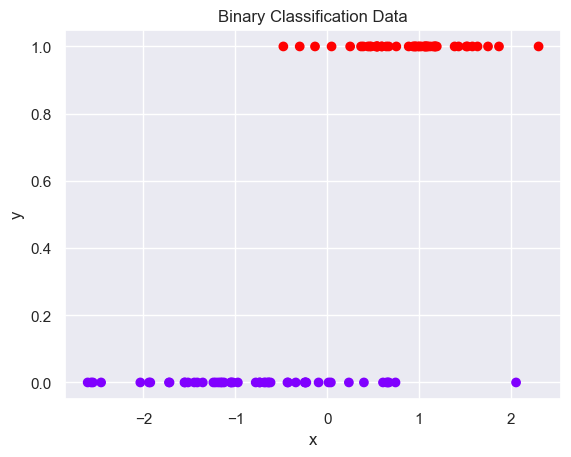
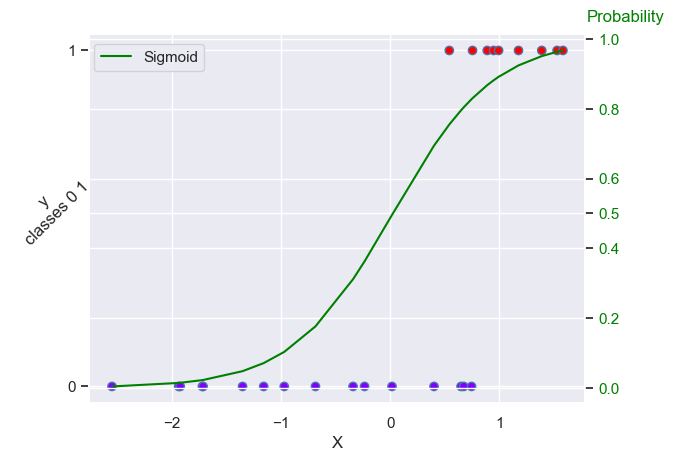

# Introduction to Logistic Regression

In this notebook you will see how logistic regression works very graphically. 


```python
import pandas as pd
import numpy as np
import matplotlib.pyplot as plt 
import seaborn as sns

from sklearn.datasets import make_classification
from sklearn.linear_model import LogisticRegression
from sklearn.model_selection import train_test_split
from sklearn.metrics import confusion_matrix

sns.set()
```

Next, we’ll take advantage of the `make_classification` function from the scikit-learn library to generate data. 
Since logistic regression is primarily only applicable to binary classification problems, the data points in our case are composed of two classes.


```python
# We set a random state so the generated data is the same for each run of this cell
x, y = make_classification(
    n_samples=100,
    n_features=1,
    n_classes=2,
    n_clusters_per_class=1,
    flip_y=0.03,
    n_informative=1,
    n_redundant=0,
    n_repeated=0,
    random_state=3789
)
```


```python
data = {"x":x.reshape((100,)), "y":y.reshape((100,))}
```


```python
df = pd.DataFrame(data=data)
df
```


<div>
<style scoped>
    .dataframe tbody tr th:only-of-type {
        vertical-align: middle;
    }

    .dataframe tbody tr th {
        vertical-align: top;
    }

    .dataframe thead th {
        text-align: right;
    }
</style>
<table border="1" class="dataframe">
  <thead>
    <tr style="text-align: right;">
      <th></th>
      <th>x</th>
      <th>y</th>
    </tr>
  </thead>
  <tbody>
    <tr>
      <th>0</th>
      <td>1.071387</td>
      <td>1</td>
    </tr>
    <tr>
      <th>1</th>
      <td>1.637385</td>
      <td>1</td>
    </tr>
    <tr>
      <th>2</th>
      <td>0.946752</td>
      <td>1</td>
    </tr>
    <tr>
      <th>3</th>
      <td>2.302251</td>
      <td>1</td>
    </tr>
    <tr>
      <th>4</th>
      <td>0.528806</td>
      <td>1</td>
    </tr>
    <tr>
      <th>...</th>
      <td>...</td>
      <td>...</td>
    </tr>
    <tr>
      <th>95</th>
      <td>-1.414146</td>
      <td>0</td>
    </tr>
    <tr>
      <th>96</th>
      <td>1.119315</td>
      <td>1</td>
    </tr>
    <tr>
      <th>97</th>
      <td>-1.354310</td>
      <td>0</td>
    </tr>
    <tr>
      <th>98</th>
      <td>0.547361</td>
      <td>1</td>
    </tr>
    <tr>
      <th>99</th>
      <td>-0.237470</td>
      <td>0</td>
    </tr>
  </tbody>
</table>
<p>100 rows × 2 columns</p>
</div>


```python
# statistical properties for each class y (0,1)
statistical_properties_for_class = df.groupby(by=['y'])[["x"]].describe()
statistical_properties_for_class
```


<div>
<style scoped>
    .dataframe tbody tr th:only-of-type {
        vertical-align: middle;
    }

    .dataframe tbody tr th {
        vertical-align: top;
    }

    .dataframe thead tr th {
        text-align: left;
    }

    .dataframe thead tr:last-of-type th {
        text-align: right;
    }
</style>
<table border="1" class="dataframe">
  <thead>
    <tr>
      <th></th>
      <th colspan="8" halign="left">x</th>
    </tr>
    <tr>
      <th></th>
      <th>count</th>
      <th>mean</th>
      <th>std</th>
      <th>min</th>
      <th>25%</th>
      <th>50%</th>
      <th>75%</th>
      <th>max</th>
    </tr>
    <tr>
      <th>y</th>
      <th></th>
      <th></th>
      <th></th>
      <th></th>
      <th></th>
      <th></th>
      <th></th>
      <th></th>
    </tr>
  </thead>
  <tbody>
    <tr>
      <th>0</th>
      <td>51.0</td>
      <td>-0.807349</td>
      <td>0.969754</td>
      <td>-2.607748</td>
      <td>-1.430320</td>
      <td>-0.778034</td>
      <td>-0.236799</td>
      <td>2.057215</td>
    </tr>
    <tr>
      <th>1</th>
      <td>49.0</td>
      <td>0.891327</td>
      <td>0.544230</td>
      <td>-0.476926</td>
      <td>0.542125</td>
      <td>0.965722</td>
      <td>1.169664</td>
      <td>2.302251</td>
    </tr>
  </tbody>
</table>
</div>


```python
# We plot the relationship between the feature and classes. 
plt.scatter(x, y, c=y, cmap='rainbow')
plt.xlabel('x')
plt.ylabel('y')
plt.title("Binary Classification Data")
plt.savefig("binary_classification_data.png");
```


    

    


The above depicts a graph of a binary classification dataset.  The y-axis represents the true class labels for each data point. In this dataset, y = 0 likely represents the negative class and y=1 represents the positive class. The x-axis,  depicts one variable.
For observation belonging to the negative class (y=0) x ranges from -2.6 and 2.03, and for observation belonging to the positive class (y=1) x ranges from -0.48 and 2.30. Check statistical_properties_for_class python variable for more statistical information.


```python
# Prior to training our model, we’ll set aside a portion of our data in order to evaluate its performance.
X_train, X_test, y_train, y_test = train_test_split(x, y, random_state=1)
```


```python
# We instantiate an instance of the LogisticRegression class and call the fit function with the features and the labels 
# (since Logistic Regression is a supervised machine learning algorithm) as arguments.

lr = LogisticRegression()
lr.fit(X_train, y_train)
```


<style>#sk-container-id-1 {color: black;background-color: white;}#sk-container-id-1 pre{padding: 0;}#sk-container-id-1 div.sk-toggleable {background-color: white;}#sk-container-id-1 label.sk-toggleable__label {cursor: pointer;display: block;width: 100%;margin-bottom: 0;padding: 0.3em;box-sizing: border-box;text-align: center;}#sk-container-id-1 label.sk-toggleable__label-arrow:before {content: "▸";float: left;margin-right: 0.25em;color: #696969;}#sk-container-id-1 label.sk-toggleable__label-arrow:hover:before {color: black;}#sk-container-id-1 div.sk-estimator:hover label.sk-toggleable__label-arrow:before {color: black;}#sk-container-id-1 div.sk-toggleable__content {max-height: 0;max-width: 0;overflow: hidden;text-align: left;background-color: #f0f8ff;}#sk-container-id-1 div.sk-toggleable__content pre {margin: 0.2em;color: black;border-radius: 0.25em;background-color: #f0f8ff;}#sk-container-id-1 input.sk-toggleable__control:checked~div.sk-toggleable__content {max-height: 200px;max-width: 100%;overflow: auto;}#sk-container-id-1 input.sk-toggleable__control:checked~label.sk-toggleable__label-arrow:before {content: "▾";}#sk-container-id-1 div.sk-estimator input.sk-toggleable__control:checked~label.sk-toggleable__label {background-color: #d4ebff;}#sk-container-id-1 div.sk-label input.sk-toggleable__control:checked~label.sk-toggleable__label {background-color: #d4ebff;}#sk-container-id-1 input.sk-hidden--visually {border: 0;clip: rect(1px 1px 1px 1px);clip: rect(1px, 1px, 1px, 1px);height: 1px;margin: -1px;overflow: hidden;padding: 0;position: absolute;width: 1px;}#sk-container-id-1 div.sk-estimator {font-family: monospace;background-color: #f0f8ff;border: 1px dotted black;border-radius: 0.25em;box-sizing: border-box;margin-bottom: 0.5em;}#sk-container-id-1 div.sk-estimator:hover {background-color: #d4ebff;}#sk-container-id-1 div.sk-parallel-item::after {content: "";width: 100%;border-bottom: 1px solid gray;flex-grow: 1;}#sk-container-id-1 div.sk-label:hover label.sk-toggleable__label {background-color: #d4ebff;}#sk-container-id-1 div.sk-serial::before {content: "";position: absolute;border-left: 1px solid gray;box-sizing: border-box;top: 0;bottom: 0;left: 50%;z-index: 0;}#sk-container-id-1 div.sk-serial {display: flex;flex-direction: column;align-items: center;background-color: white;padding-right: 0.2em;padding-left: 0.2em;position: relative;}#sk-container-id-1 div.sk-item {position: relative;z-index: 1;}#sk-container-id-1 div.sk-parallel {display: flex;align-items: stretch;justify-content: center;background-color: white;position: relative;}#sk-container-id-1 div.sk-item::before, #sk-container-id-1 div.sk-parallel-item::before {content: "";position: absolute;border-left: 1px solid gray;box-sizing: border-box;top: 0;bottom: 0;left: 50%;z-index: -1;}#sk-container-id-1 div.sk-parallel-item {display: flex;flex-direction: column;z-index: 1;position: relative;background-color: white;}#sk-container-id-1 div.sk-parallel-item:first-child::after {align-self: flex-end;width: 50%;}#sk-container-id-1 div.sk-parallel-item:last-child::after {align-self: flex-start;width: 50%;}#sk-container-id-1 div.sk-parallel-item:only-child::after {width: 0;}#sk-container-id-1 div.sk-dashed-wrapped {border: 1px dashed gray;margin: 0 0.4em 0.5em 0.4em;box-sizing: border-box;padding-bottom: 0.4em;background-color: white;}#sk-container-id-1 div.sk-label label {font-family: monospace;font-weight: bold;display: inline-block;line-height: 1.2em;}#sk-container-id-1 div.sk-label-container {text-align: center;}#sk-container-id-1 div.sk-container {/* jupyter's `normalize.less` sets `[hidden] { display: none; }` but bootstrap.min.css set `[hidden] { display: none !important; }` so we also need the `!important` here to be able to override the default hidden behavior on the sphinx rendered scikit-learn.org. See: https://github.com/scikit-learn/scikit-learn/issues/21755 */display: inline-block !important;position: relative;}#sk-container-id-1 div.sk-text-repr-fallback {display: none;}</style><div id="sk-container-id-1" class="sk-top-container"><div class="sk-text-repr-fallback"><pre>LogisticRegression()</pre><b>In a Jupyter environment, please rerun this cell to show the HTML representation or trust the notebook. <br />On GitHub, the HTML representation is unable to render, please try loading this page with nbviewer.org.</b></div><div class="sk-container" hidden><div class="sk-item"><div class="sk-estimator sk-toggleable"><input class="sk-toggleable__control sk-hidden--visually" id="sk-estimator-id-1" type="checkbox" checked><label for="sk-estimator-id-1" class="sk-toggleable__label sk-toggleable__label-arrow">LogisticRegression</label><div class="sk-toggleable__content"><pre>LogisticRegression()</pre></div></div></div></div></div>


```python
# We can access the following properties to actually view the model parameter.
print(lr.coef_)
print(lr.intercept_)
```

    [[2.17662474]]
    [-0.05037611]


```python
# Let’s see how the model performs against data that it hasn’t been trained on.
y_pred = lr.predict(X_test)
```


```python
# Given that this is a classification problem, we use a confusion matrix to evaluate our model.
confusion_matrix(y_test, y_pred)
```


    array([[12,  4],
           [ 0,  9]])


```python
# If for whatever reason we’d like to check the actual probability that a data point belongs to a given class, 
# we can use the predict_proba function.
lr.predict_proba(X_test)
```


    array([[0.98582561, 0.01417439],
           [0.17225006, 0.82774994],
           [0.92934938, 0.07065062],
           [0.13215422, 0.86784578],
           [0.68864373, 0.31135627],
           [0.16949557, 0.83050443],
           [0.99632542, 0.00367458],
           [0.97810516, 0.02189484],
           [0.89721872, 0.10278128],
           [0.97781542, 0.02218458],
           [0.63745537, 0.36254463],
           [0.2042561 , 0.7957439 ],
           [0.10819387, 0.89180613],
           [0.82404145, 0.17595855],
           [0.0325378 , 0.9674622 ],
           [0.07543907, 0.92456093],
           [0.30554031, 0.69445969],
           [0.19568065, 0.80431935],
           [0.04877166, 0.95122834],
           [0.24487613, 0.75512387],
           [0.11812066, 0.88187934],
           [0.5042553 , 0.4957447 ],
           [0.95249277, 0.04750723],
           [0.03640296, 0.96359704],
           [0.98625784, 0.01374216]])


```python
pd.DataFrame(lr.predict_proba(X_test))
```


<div>
<style scoped>
    .dataframe tbody tr th:only-of-type {
        vertical-align: middle;
    }

    .dataframe tbody tr th {
        vertical-align: top;
    }

    .dataframe thead th {
        text-align: right;
    }
</style>
<table border="1" class="dataframe">
  <thead>
    <tr style="text-align: right;">
      <th></th>
      <th>0</th>
      <th>1</th>
    </tr>
  </thead>
  <tbody>
    <tr>
      <th>0</th>
      <td>0.985826</td>
      <td>0.014174</td>
    </tr>
    <tr>
      <th>1</th>
      <td>0.172250</td>
      <td>0.827750</td>
    </tr>
    <tr>
      <th>2</th>
      <td>0.929349</td>
      <td>0.070651</td>
    </tr>
    <tr>
      <th>3</th>
      <td>0.132154</td>
      <td>0.867846</td>
    </tr>
    <tr>
      <th>4</th>
      <td>0.688644</td>
      <td>0.311356</td>
    </tr>
    <tr>
      <th>5</th>
      <td>0.169496</td>
      <td>0.830504</td>
    </tr>
    <tr>
      <th>6</th>
      <td>0.996325</td>
      <td>0.003675</td>
    </tr>
    <tr>
      <th>7</th>
      <td>0.978105</td>
      <td>0.021895</td>
    </tr>
    <tr>
      <th>8</th>
      <td>0.897219</td>
      <td>0.102781</td>
    </tr>
    <tr>
      <th>9</th>
      <td>0.977815</td>
      <td>0.022185</td>
    </tr>
    <tr>
      <th>10</th>
      <td>0.637455</td>
      <td>0.362545</td>
    </tr>
    <tr>
      <th>11</th>
      <td>0.204256</td>
      <td>0.795744</td>
    </tr>
    <tr>
      <th>12</th>
      <td>0.108194</td>
      <td>0.891806</td>
    </tr>
    <tr>
      <th>13</th>
      <td>0.824041</td>
      <td>0.175959</td>
    </tr>
    <tr>
      <th>14</th>
      <td>0.032538</td>
      <td>0.967462</td>
    </tr>
    <tr>
      <th>15</th>
      <td>0.075439</td>
      <td>0.924561</td>
    </tr>
    <tr>
      <th>16</th>
      <td>0.305540</td>
      <td>0.694460</td>
    </tr>
    <tr>
      <th>17</th>
      <td>0.195681</td>
      <td>0.804319</td>
    </tr>
    <tr>
      <th>18</th>
      <td>0.048772</td>
      <td>0.951228</td>
    </tr>
    <tr>
      <th>19</th>
      <td>0.244876</td>
      <td>0.755124</td>
    </tr>
    <tr>
      <th>20</th>
      <td>0.118121</td>
      <td>0.881879</td>
    </tr>
    <tr>
      <th>21</th>
      <td>0.504255</td>
      <td>0.495745</td>
    </tr>
    <tr>
      <th>22</th>
      <td>0.952493</td>
      <td>0.047507</td>
    </tr>
    <tr>
      <th>23</th>
      <td>0.036403</td>
      <td>0.963597</td>
    </tr>
    <tr>
      <th>24</th>
      <td>0.986258</td>
      <td>0.013742</td>
    </tr>
  </tbody>
</table>
</div>


The first column corresponds to the probability that the sample belongs to the first class (our case y=0) and the second column corresponds to the probability that the sample belongs to the second class (our case y=1).
Before attempting to plot the Sigmoid function (it gives the probability that a certain observation belongs to the positive class), we create and sort a DataFrame containing our test data.

The sigmoid function reads:
$$\sigma = \dfrac{1}{1 + e^{-t}} =  \dfrac{1}{1+ e^{-(b_{0} + b_{1}*X)}}$$


```python
df = pd.DataFrame({'x': X_test[:,0], 'y': y_test})
df = df.sort_values(by='x')
```


```python
df
```


<div>
<style scoped>
    .dataframe tbody tr th:only-of-type {
        vertical-align: middle;
    }

    .dataframe tbody tr th {
        vertical-align: top;
    }

    .dataframe thead th {
        text-align: right;
    }
</style>
<table border="1" class="dataframe">
  <thead>
    <tr style="text-align: right;">
      <th></th>
      <th>x</th>
      <th>y</th>
    </tr>
  </thead>
  <tbody>
    <tr>
      <th>6</th>
      <td>-2.550857</td>
      <td>0</td>
    </tr>
    <tr>
      <th>24</th>
      <td>-1.940194</td>
      <td>0</td>
    </tr>
    <tr>
      <th>0</th>
      <td>-1.925765</td>
      <td>0</td>
    </tr>
    <tr>
      <th>7</th>
      <td>-1.722387</td>
      <td>0</td>
    </tr>
    <tr>
      <th>9</th>
      <td>-1.716211</td>
      <td>0</td>
    </tr>
    <tr>
      <th>22</th>
      <td>-1.354310</td>
      <td>0</td>
    </tr>
    <tr>
      <th>2</th>
      <td>-1.160679</td>
      <td>0</td>
    </tr>
    <tr>
      <th>8</th>
      <td>-0.972295</td>
      <td>0</td>
    </tr>
    <tr>
      <th>13</th>
      <td>-0.686198</td>
      <td>0</td>
    </tr>
    <tr>
      <th>4</th>
      <td>-0.341543</td>
      <td>0</td>
    </tr>
    <tr>
      <th>10</th>
      <td>-0.236127</td>
      <td>0</td>
    </tr>
    <tr>
      <th>21</th>
      <td>0.015324</td>
      <td>0</td>
    </tr>
    <tr>
      <th>16</th>
      <td>0.400358</td>
      <td>0</td>
    </tr>
    <tr>
      <th>19</th>
      <td>0.540518</td>
      <td>1</td>
    </tr>
    <tr>
      <th>11</th>
      <td>0.647920</td>
      <td>0</td>
    </tr>
    <tr>
      <th>17</th>
      <td>0.672550</td>
      <td>0</td>
    </tr>
    <tr>
      <th>1</th>
      <td>0.744336</td>
      <td>0</td>
    </tr>
    <tr>
      <th>5</th>
      <td>0.753268</td>
      <td>1</td>
    </tr>
    <tr>
      <th>3</th>
      <td>0.887806</td>
      <td>1</td>
    </tr>
    <tr>
      <th>20</th>
      <td>0.946752</td>
      <td>1</td>
    </tr>
    <tr>
      <th>12</th>
      <td>0.992224</td>
      <td>1</td>
    </tr>
    <tr>
      <th>15</th>
      <td>1.174465</td>
      <td>1</td>
    </tr>
    <tr>
      <th>18</th>
      <td>1.387920</td>
      <td>1</td>
    </tr>
    <tr>
      <th>23</th>
      <td>1.528237</td>
      <td>1</td>
    </tr>
    <tr>
      <th>14</th>
      <td>1.581646</td>
      <td>1</td>
    </tr>
  </tbody>
</table>
</div>


```python
from scipy.special import expit

sigmoid_function = expit(df['x'] * lr.coef_[0][0] + lr.intercept_[0]).ravel()
```


```python
fig, ax = plt.subplots(sharey=True)

# Plot binary classification data
ax.scatter(df['x'], df['y'], c=df['y'], cmap='rainbow', edgecolors='b')
ax.tick_params(axis='y')
ax.set_xlabel('X')
ax.set_ylabel('y\nclasses 0 1', rotation=45)
ax.set_yticks([0.0, 1.0])

# Generate a new Axes instance, on the twin-X axes (same position)
ax2 = ax.twinx()

# Plot sigmoid function, change tick color
ax2.plot(df['x'],sigmoid_function, color='green', label= "Sigmoid")
ax2.tick_params(axis='y', labelcolor='green')
ax2.set_yticks(np.insert(ax2.get_yticks()[1:-1], 3, 0.5))
ax2.text(x=1.8,y=1.05,s="Probability",color='Green')

ax2.legend(loc=(0.01,0.9))
plt.show()
```


    

    


The above depicts a graph of a binary classification dataset.  The y-axis represents the true class labels for each data point. In this dataset, y = 0 likely represents the negative class and y=1 represents the positive class. The x-axis,  depicts one variable.
For observation belonging to the negative class (y=0) x ranges from -2.55 and 0.74 showed with blue dots, and for observation belonging to the positive class (y=1) x ranges from 0.54 and 1.58 and showed by red dots. There is a green line representing the sigmoid function which in y =0.5 (threshold) has the x = 0. there is 5 blue dots which have x > 0.

**Check your understanding:**
- Which value of X correspond to a probability threshold of 0.5?
- How many data points will be misclassified in the graph above if you choose a probability threshold at 0.5?
- Which threshold would you choose to improve the accuracy?
- Which threshold would you choose to improve recall?


```python

```
