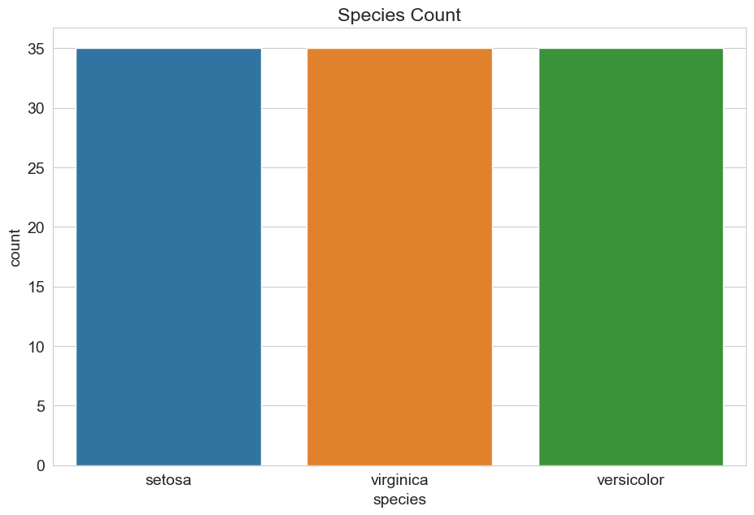
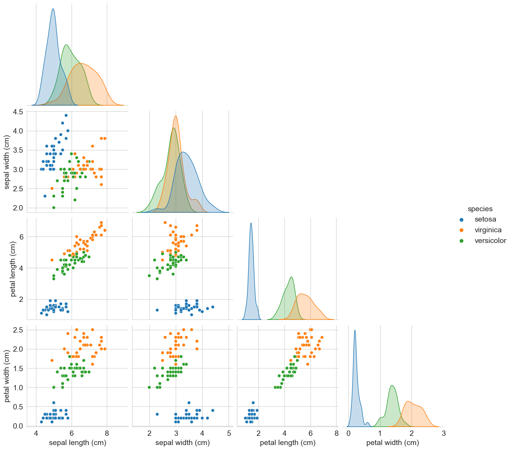
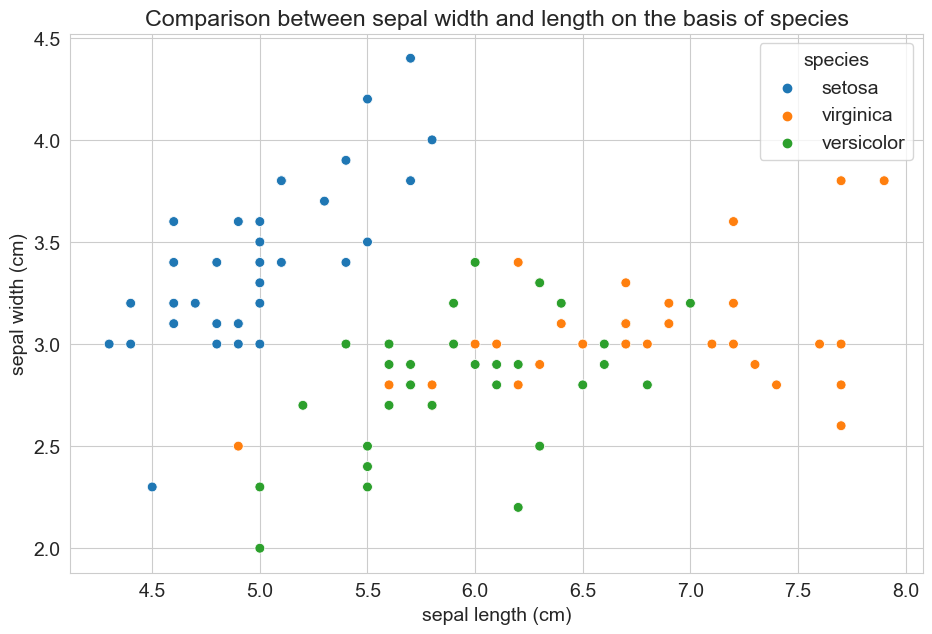
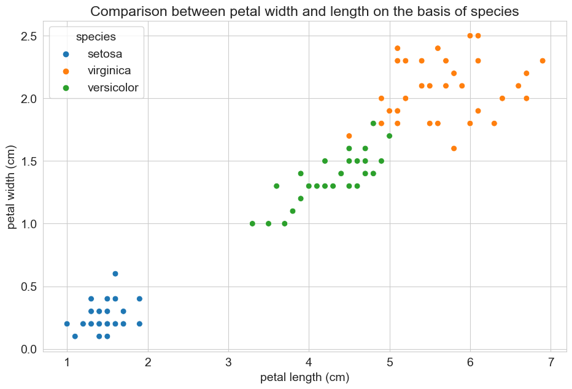
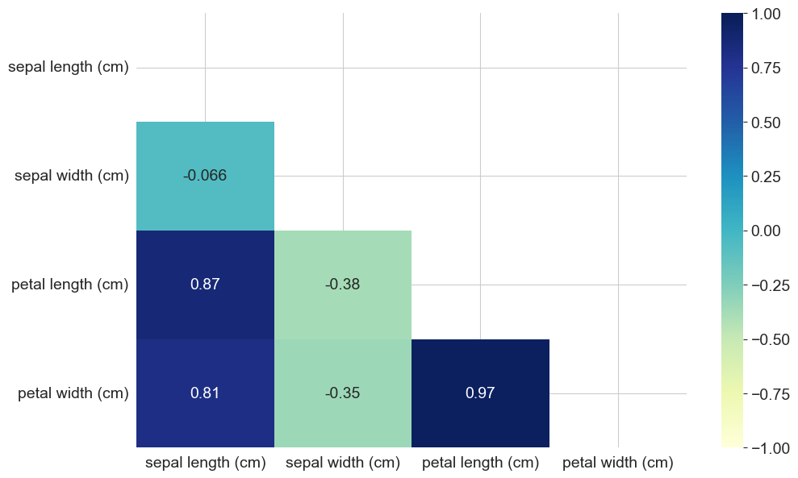
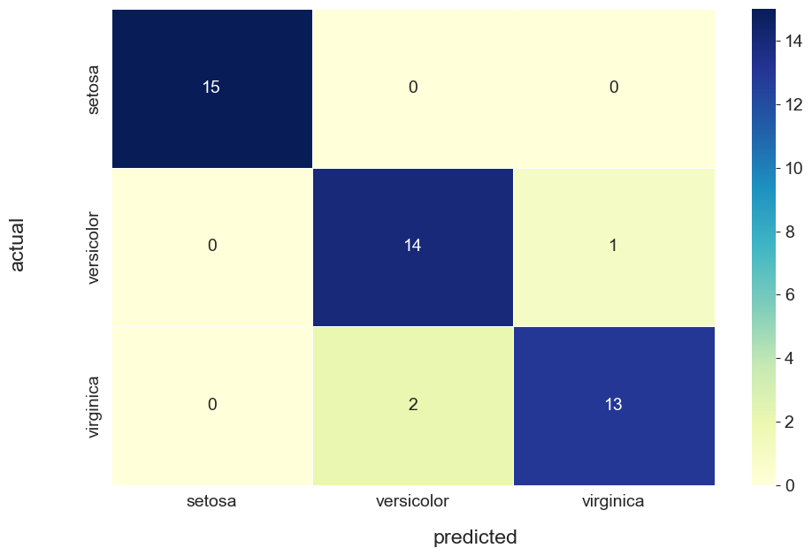

# Multiclass Classification

In this notebook we will use the flower iris dataset which is often called the "Hello world!" of Machine Learning.

Our aim is to train a model which predicts the iris species, e.g, setosa, versicolor', virginica based on its petal and sepal measures. In our case we are not dealing with a binary classification problem but with a multiclass classification problem. Our model should be able to predict one of the three iris species. 

Writing the code for training a multiclass logistic regression model works exactly as when dealing with a binary problem. If you are interested in how logistic regression handles multiclass problems have a look at the sklearn [documentation](https://scikit-learn.org/stable/modules/generated/sklearn.linear_model.LogisticRegression.html).

After got the data and defined our features and the target variable, we will split the dataset into 70% trainings data and 30% testing data. Then, 
1. we make a short EDA on the train data
2. we will train (fit) our logistic regression model on the training data and evaluate the performance on the remaining 30%. 


At this point of the course the structure of the notebook should be familiar to you. At the end you should:
* know one of the most popular data sets in machine learning ;) 
* know how to apply logistic regression to a multiclass problem

## Setup and Data

We will begin with importing the required libraries and data. This time we will import the dataset directly from sklearn. Sklearn provide some of the most commonly used [toy data sets](https://scikit-learn.org/stable/datasets/toy_dataset.html) for learning and practicing machine learning. 


```python
# Import libraries
import pandas as pd
import numpy as np
import matplotlib.pyplot as plt
import seaborn as sns

from sklearn.datasets import load_iris
from sklearn.model_selection import train_test_split
from sklearn.linear_model import LogisticRegression
from sklearn.metrics import confusion_matrix, classification_report, accuracy_score

# Set plotting style
sns.set_style('whitegrid')
plt.rcParams['font.size'] = 14
plt.rcParams['figure.figsize'] = (11, 7)
```


```python
# Import data from sklearn.datasets
data = load_iris()
data
```


    {'data': array([[5.1, 3.5, 1.4, 0.2],
            [4.9, 3. , 1.4, 0.2],
            [4.7, 3.2, 1.3, 0.2],
            [4.6, 3.1, 1.5, 0.2],
            [5. , 3.6, 1.4, 0.2],
            [5.4, 3.9, 1.7, 0.4],
            [4.6, 3.4, 1.4, 0.3],
            [5. , 3.4, 1.5, 0.2],
            [4.4, 2.9, 1.4, 0.2],
            [4.9, 3.1, 1.5, 0.1],
            [5.4, 3.7, 1.5, 0.2],
            [4.8, 3.4, 1.6, 0.2],
            [4.8, 3. , 1.4, 0.1],
            [4.3, 3. , 1.1, 0.1],
            [5.8, 4. , 1.2, 0.2],
            [5.7, 4.4, 1.5, 0.4],
            [5.4, 3.9, 1.3, 0.4],
            [5.1, 3.5, 1.4, 0.3],
            [5.7, 3.8, 1.7, 0.3],
            [5.1, 3.8, 1.5, 0.3],
            [5.4, 3.4, 1.7, 0.2],
            [5.1, 3.7, 1.5, 0.4],
            [4.6, 3.6, 1. , 0.2],
            [5.1, 3.3, 1.7, 0.5],
            [4.8, 3.4, 1.9, 0.2],
            [5. , 3. , 1.6, 0.2],
            [5. , 3.4, 1.6, 0.4],
            [5.2, 3.5, 1.5, 0.2],
            [5.2, 3.4, 1.4, 0.2],
            [4.7, 3.2, 1.6, 0.2],
            [4.8, 3.1, 1.6, 0.2],
            [5.4, 3.4, 1.5, 0.4],
            [5.2, 4.1, 1.5, 0.1],
            [5.5, 4.2, 1.4, 0.2],
            [4.9, 3.1, 1.5, 0.2],
            [5. , 3.2, 1.2, 0.2],
            [5.5, 3.5, 1.3, 0.2],
            [4.9, 3.6, 1.4, 0.1],
            [4.4, 3. , 1.3, 0.2],
            [5.1, 3.4, 1.5, 0.2],
            [5. , 3.5, 1.3, 0.3],
            [4.5, 2.3, 1.3, 0.3],
            [4.4, 3.2, 1.3, 0.2],
            [5. , 3.5, 1.6, 0.6],
            [5.1, 3.8, 1.9, 0.4],
            [4.8, 3. , 1.4, 0.3],
            [5.1, 3.8, 1.6, 0.2],
            [4.6, 3.2, 1.4, 0.2],
            [5.3, 3.7, 1.5, 0.2],
            [5. , 3.3, 1.4, 0.2],
            [7. , 3.2, 4.7, 1.4],
            [6.4, 3.2, 4.5, 1.5],
            [6.9, 3.1, 4.9, 1.5],
            [5.5, 2.3, 4. , 1.3],
            [6.5, 2.8, 4.6, 1.5],
            [5.7, 2.8, 4.5, 1.3],
            [6.3, 3.3, 4.7, 1.6],
            [4.9, 2.4, 3.3, 1. ],
            [6.6, 2.9, 4.6, 1.3],
            [5.2, 2.7, 3.9, 1.4],
            [5. , 2. , 3.5, 1. ],
            [5.9, 3. , 4.2, 1.5],
            [6. , 2.2, 4. , 1. ],
            [6.1, 2.9, 4.7, 1.4],
            [5.6, 2.9, 3.6, 1.3],
            [6.7, 3.1, 4.4, 1.4],
            [5.6, 3. , 4.5, 1.5],
            [5.8, 2.7, 4.1, 1. ],
            [6.2, 2.2, 4.5, 1.5],
            [5.6, 2.5, 3.9, 1.1],
            [5.9, 3.2, 4.8, 1.8],
            [6.1, 2.8, 4. , 1.3],
            [6.3, 2.5, 4.9, 1.5],
            [6.1, 2.8, 4.7, 1.2],
            [6.4, 2.9, 4.3, 1.3],
            [6.6, 3. , 4.4, 1.4],
            [6.8, 2.8, 4.8, 1.4],
            [6.7, 3. , 5. , 1.7],
            [6. , 2.9, 4.5, 1.5],
            [5.7, 2.6, 3.5, 1. ],
            [5.5, 2.4, 3.8, 1.1],
            [5.5, 2.4, 3.7, 1. ],
            [5.8, 2.7, 3.9, 1.2],
            [6. , 2.7, 5.1, 1.6],
            [5.4, 3. , 4.5, 1.5],
            [6. , 3.4, 4.5, 1.6],
            [6.7, 3.1, 4.7, 1.5],
            [6.3, 2.3, 4.4, 1.3],
            [5.6, 3. , 4.1, 1.3],
            [5.5, 2.5, 4. , 1.3],
            [5.5, 2.6, 4.4, 1.2],
            [6.1, 3. , 4.6, 1.4],
            [5.8, 2.6, 4. , 1.2],
            [5. , 2.3, 3.3, 1. ],
            [5.6, 2.7, 4.2, 1.3],
            [5.7, 3. , 4.2, 1.2],
            [5.7, 2.9, 4.2, 1.3],
            [6.2, 2.9, 4.3, 1.3],
            [5.1, 2.5, 3. , 1.1],
            [5.7, 2.8, 4.1, 1.3],
            [6.3, 3.3, 6. , 2.5],
            [5.8, 2.7, 5.1, 1.9],
            [7.1, 3. , 5.9, 2.1],
            [6.3, 2.9, 5.6, 1.8],
            [6.5, 3. , 5.8, 2.2],
            [7.6, 3. , 6.6, 2.1],
            [4.9, 2.5, 4.5, 1.7],
            [7.3, 2.9, 6.3, 1.8],
            [6.7, 2.5, 5.8, 1.8],
            [7.2, 3.6, 6.1, 2.5],
            [6.5, 3.2, 5.1, 2. ],
            [6.4, 2.7, 5.3, 1.9],
            [6.8, 3. , 5.5, 2.1],
            [5.7, 2.5, 5. , 2. ],
            [5.8, 2.8, 5.1, 2.4],
            [6.4, 3.2, 5.3, 2.3],
            [6.5, 3. , 5.5, 1.8],
            [7.7, 3.8, 6.7, 2.2],
            [7.7, 2.6, 6.9, 2.3],
            [6. , 2.2, 5. , 1.5],
            [6.9, 3.2, 5.7, 2.3],
            [5.6, 2.8, 4.9, 2. ],
            [7.7, 2.8, 6.7, 2. ],
            [6.3, 2.7, 4.9, 1.8],
            [6.7, 3.3, 5.7, 2.1],
            [7.2, 3.2, 6. , 1.8],
            [6.2, 2.8, 4.8, 1.8],
            [6.1, 3. , 4.9, 1.8],
            [6.4, 2.8, 5.6, 2.1],
            [7.2, 3. , 5.8, 1.6],
            [7.4, 2.8, 6.1, 1.9],
            [7.9, 3.8, 6.4, 2. ],
            [6.4, 2.8, 5.6, 2.2],
            [6.3, 2.8, 5.1, 1.5],
            [6.1, 2.6, 5.6, 1.4],
            [7.7, 3. , 6.1, 2.3],
            [6.3, 3.4, 5.6, 2.4],
            [6.4, 3.1, 5.5, 1.8],
            [6. , 3. , 4.8, 1.8],
            [6.9, 3.1, 5.4, 2.1],
            [6.7, 3.1, 5.6, 2.4],
            [6.9, 3.1, 5.1, 2.3],
            [5.8, 2.7, 5.1, 1.9],
            [6.8, 3.2, 5.9, 2.3],
            [6.7, 3.3, 5.7, 2.5],
            [6.7, 3. , 5.2, 2.3],
            [6.3, 2.5, 5. , 1.9],
            [6.5, 3. , 5.2, 2. ],
            [6.2, 3.4, 5.4, 2.3],
            [5.9, 3. , 5.1, 1.8]]),
     'target': array([0, 0, 0, 0, 0, 0, 0, 0, 0, 0, 0, 0, 0, 0, 0, 0, 0, 0, 0, 0, 0, 0,
            0, 0, 0, 0, 0, 0, 0, 0, 0, 0, 0, 0, 0, 0, 0, 0, 0, 0, 0, 0, 0, 0,
            0, 0, 0, 0, 0, 0, 1, 1, 1, 1, 1, 1, 1, 1, 1, 1, 1, 1, 1, 1, 1, 1,
            1, 1, 1, 1, 1, 1, 1, 1, 1, 1, 1, 1, 1, 1, 1, 1, 1, 1, 1, 1, 1, 1,
            1, 1, 1, 1, 1, 1, 1, 1, 1, 1, 1, 1, 2, 2, 2, 2, 2, 2, 2, 2, 2, 2,
            2, 2, 2, 2, 2, 2, 2, 2, 2, 2, 2, 2, 2, 2, 2, 2, 2, 2, 2, 2, 2, 2,
            2, 2, 2, 2, 2, 2, 2, 2, 2, 2, 2, 2, 2, 2, 2, 2, 2, 2]),
     'frame': None,
     'target_names': array(['setosa', 'versicolor', 'virginica'], dtype='<U10'),
     'DESCR': '.. _iris_dataset:\n\nIris plants dataset\n--------------------\n\n**Data Set Characteristics:**\n\n    :Number of Instances: 150 (50 in each of three classes)\n    :Number of Attributes: 4 numeric, predictive attributes and the class\n    :Attribute Information:\n        - sepal length in cm\n        - sepal width in cm\n        - petal length in cm\n        - petal width in cm\n        - class:\n                - Iris-Setosa\n                - Iris-Versicolour\n                - Iris-Virginica\n                \n    :Summary Statistics:\n\n    ============== ==== ==== ======= ===== ====================\n                    Min  Max   Mean    SD   Class Correlation\n    ============== ==== ==== ======= ===== ====================\n    sepal length:   4.3  7.9   5.84   0.83    0.7826\n    sepal width:    2.0  4.4   3.05   0.43   -0.4194\n    petal length:   1.0  6.9   3.76   1.76    0.9490  (high!)\n    petal width:    0.1  2.5   1.20   0.76    0.9565  (high!)\n    ============== ==== ==== ======= ===== ====================\n\n    :Missing Attribute Values: None\n    :Class Distribution: 33.3% for each of 3 classes.\n    :Creator: R.A. Fisher\n    :Donor: Michael Marshall (MARSHALL%PLU@io.arc.nasa.gov)\n    :Date: July, 1988\n\nThe famous Iris database, first used by Sir R.A. Fisher. The dataset is taken\nfrom Fisher\'s paper. Note that it\'s the same as in R, but not as in the UCI\nMachine Learning Repository, which has two wrong data points.\n\nThis is perhaps the best known database to be found in the\npattern recognition literature.  Fisher\'s paper is a classic in the field and\nis referenced frequently to this day.  (See Duda & Hart, for example.)  The\ndata set contains 3 classes of 50 instances each, where each class refers to a\ntype of iris plant.  One class is linearly separable from the other 2; the\nlatter are NOT linearly separable from each other.\n\n.. topic:: References\n\n   - Fisher, R.A. "The use of multiple measurements in taxonomic problems"\n     Annual Eugenics, 7, Part II, 179-188 (1936); also in "Contributions to\n     Mathematical Statistics" (John Wiley, NY, 1950).\n   - Duda, R.O., & Hart, P.E. (1973) Pattern Classification and Scene Analysis.\n     (Q327.D83) John Wiley & Sons.  ISBN 0-471-22361-1.  See page 218.\n   - Dasarathy, B.V. (1980) "Nosing Around the Neighborhood: A New System\n     Structure and Classification Rule for Recognition in Partially Exposed\n     Environments".  IEEE Transactions on Pattern Analysis and Machine\n     Intelligence, Vol. PAMI-2, No. 1, 67-71.\n   - Gates, G.W. (1972) "The Reduced Nearest Neighbor Rule".  IEEE Transactions\n     on Information Theory, May 1972, 431-433.\n   - See also: 1988 MLC Proceedings, 54-64.  Cheeseman et al"s AUTOCLASS II\n     conceptual clustering system finds 3 classes in the data.\n   - Many, many more ...',
     'feature_names': ['sepal length (cm)',
      'sepal width (cm)',
      'petal length (cm)',
      'petal width (cm)'],
     'filename': 'iris.csv',
     'data_module': 'sklearn.datasets.data'}


## Define features and Target


```python
# Define features and target
X = data.data
y = data.target
target_names = data.target_names
target_names
```


    array(['setosa', 'versicolor', 'virginica'], dtype='<U10')


## Train-Test split


```python
X_train, X_test, y_train, y_test = train_test_split(X, y, test_size=0.3, random_state=15, shuffle=True, stratify=y)

# Check the shape of the data sets
print("X_train shape:", X_train.shape)
print("y_train shape:", y_train.shape)
print("X_test shape:", X_test.shape)
print("y_test shape:", y_test.shape)
```

    X_train shape: (105, 4)
    y_train shape: (105,)
    X_test shape: (45, 4)
    y_test shape: (45,)


## Exploratory Data Analysis


```python
# Check data type
print("X_train data type:", type(X_train))
print("y_train data type:", type(y_train))
```

    X_train data type: <class 'numpy.ndarray'>
    y_train data type: <class 'numpy.ndarray'>


```python
# Convert X_train to dataframe
df_X_train = pd.DataFrame(data=X_train, columns=data.feature_names)
df_X_train
```


<div>
<style scoped>
    .dataframe tbody tr th:only-of-type {
        vertical-align: middle;
    }

    .dataframe tbody tr th {
        vertical-align: top;
    }

    .dataframe thead th {
        text-align: right;
    }
</style>
<table border="1" class="dataframe">
  <thead>
    <tr style="text-align: right;">
      <th></th>
      <th>sepal length (cm)</th>
      <th>sepal width (cm)</th>
      <th>petal length (cm)</th>
      <th>petal width (cm)</th>
    </tr>
  </thead>
  <tbody>
    <tr>
      <th>0</th>
      <td>4.6</td>
      <td>3.2</td>
      <td>1.4</td>
      <td>0.2</td>
    </tr>
    <tr>
      <th>1</th>
      <td>6.7</td>
      <td>3.3</td>
      <td>5.7</td>
      <td>2.1</td>
    </tr>
    <tr>
      <th>2</th>
      <td>5.8</td>
      <td>2.7</td>
      <td>5.1</td>
      <td>1.9</td>
    </tr>
    <tr>
      <th>3</th>
      <td>4.3</td>
      <td>3.0</td>
      <td>1.1</td>
      <td>0.1</td>
    </tr>
    <tr>
      <th>4</th>
      <td>6.6</td>
      <td>2.9</td>
      <td>4.6</td>
      <td>1.3</td>
    </tr>
    <tr>
      <th>...</th>
      <td>...</td>
      <td>...</td>
      <td>...</td>
      <td>...</td>
    </tr>
    <tr>
      <th>100</th>
      <td>5.3</td>
      <td>3.7</td>
      <td>1.5</td>
      <td>0.2</td>
    </tr>
    <tr>
      <th>101</th>
      <td>5.9</td>
      <td>3.2</td>
      <td>4.8</td>
      <td>1.8</td>
    </tr>
    <tr>
      <th>102</th>
      <td>7.2</td>
      <td>3.6</td>
      <td>6.1</td>
      <td>2.5</td>
    </tr>
    <tr>
      <th>103</th>
      <td>4.4</td>
      <td>3.2</td>
      <td>1.3</td>
      <td>0.2</td>
    </tr>
    <tr>
      <th>104</th>
      <td>7.7</td>
      <td>2.6</td>
      <td>6.9</td>
      <td>2.3</td>
    </tr>
  </tbody>
</table>
<p>105 rows × 4 columns</p>
</div>


```python
# Convert y_train to dataframe
df_y_train = pd.DataFrame(data=y_train, columns=['species'])
df_y_train
```


<div>
<style scoped>
    .dataframe tbody tr th:only-of-type {
        vertical-align: middle;
    }

    .dataframe tbody tr th {
        vertical-align: top;
    }

    .dataframe thead th {
        text-align: right;
    }
</style>
<table border="1" class="dataframe">
  <thead>
    <tr style="text-align: right;">
      <th></th>
      <th>species</th>
    </tr>
  </thead>
  <tbody>
    <tr>
      <th>0</th>
      <td>0</td>
    </tr>
    <tr>
      <th>1</th>
      <td>2</td>
    </tr>
    <tr>
      <th>2</th>
      <td>2</td>
    </tr>
    <tr>
      <th>3</th>
      <td>0</td>
    </tr>
    <tr>
      <th>4</th>
      <td>1</td>
    </tr>
    <tr>
      <th>...</th>
      <td>...</td>
    </tr>
    <tr>
      <th>100</th>
      <td>0</td>
    </tr>
    <tr>
      <th>101</th>
      <td>1</td>
    </tr>
    <tr>
      <th>102</th>
      <td>2</td>
    </tr>
    <tr>
      <th>103</th>
      <td>0</td>
    </tr>
    <tr>
      <th>104</th>
      <td>2</td>
    </tr>
  </tbody>
</table>
<p>105 rows × 1 columns</p>
</div>


```python
# Combine df_X_train and df_y_train into df_train
df_train = pd.concat([df_X_train,df_y_train], axis=1,ignore_index=False)
df_train
```


<div>
<style scoped>
    .dataframe tbody tr th:only-of-type {
        vertical-align: middle;
    }

    .dataframe tbody tr th {
        vertical-align: top;
    }

    .dataframe thead th {
        text-align: right;
    }
</style>
<table border="1" class="dataframe">
  <thead>
    <tr style="text-align: right;">
      <th></th>
      <th>sepal length (cm)</th>
      <th>sepal width (cm)</th>
      <th>petal length (cm)</th>
      <th>petal width (cm)</th>
      <th>species</th>
    </tr>
  </thead>
  <tbody>
    <tr>
      <th>0</th>
      <td>4.6</td>
      <td>3.2</td>
      <td>1.4</td>
      <td>0.2</td>
      <td>0</td>
    </tr>
    <tr>
      <th>1</th>
      <td>6.7</td>
      <td>3.3</td>
      <td>5.7</td>
      <td>2.1</td>
      <td>2</td>
    </tr>
    <tr>
      <th>2</th>
      <td>5.8</td>
      <td>2.7</td>
      <td>5.1</td>
      <td>1.9</td>
      <td>2</td>
    </tr>
    <tr>
      <th>3</th>
      <td>4.3</td>
      <td>3.0</td>
      <td>1.1</td>
      <td>0.1</td>
      <td>0</td>
    </tr>
    <tr>
      <th>4</th>
      <td>6.6</td>
      <td>2.9</td>
      <td>4.6</td>
      <td>1.3</td>
      <td>1</td>
    </tr>
    <tr>
      <th>...</th>
      <td>...</td>
      <td>...</td>
      <td>...</td>
      <td>...</td>
      <td>...</td>
    </tr>
    <tr>
      <th>100</th>
      <td>5.3</td>
      <td>3.7</td>
      <td>1.5</td>
      <td>0.2</td>
      <td>0</td>
    </tr>
    <tr>
      <th>101</th>
      <td>5.9</td>
      <td>3.2</td>
      <td>4.8</td>
      <td>1.8</td>
      <td>1</td>
    </tr>
    <tr>
      <th>102</th>
      <td>7.2</td>
      <td>3.6</td>
      <td>6.1</td>
      <td>2.5</td>
      <td>2</td>
    </tr>
    <tr>
      <th>103</th>
      <td>4.4</td>
      <td>3.2</td>
      <td>1.3</td>
      <td>0.2</td>
      <td>0</td>
    </tr>
    <tr>
      <th>104</th>
      <td>7.7</td>
      <td>2.6</td>
      <td>6.9</td>
      <td>2.3</td>
      <td>2</td>
    </tr>
  </tbody>
</table>
<p>105 rows × 5 columns</p>
</div>


```python
# Replace 0 with setosa, 1 with versicolar and 2 with virginica in the columns species
df_train.species.replace({0: target_names[0], 1: target_names[1], 2: target_names[2]}, inplace=True)
```


```python
# Check result
df_train.head(2)
```


<div>
<style scoped>
    .dataframe tbody tr th:only-of-type {
        vertical-align: middle;
    }

    .dataframe tbody tr th {
        vertical-align: top;
    }

    .dataframe thead th {
        text-align: right;
    }
</style>
<table border="1" class="dataframe">
  <thead>
    <tr style="text-align: right;">
      <th></th>
      <th>sepal length (cm)</th>
      <th>sepal width (cm)</th>
      <th>petal length (cm)</th>
      <th>petal width (cm)</th>
      <th>species</th>
    </tr>
  </thead>
  <tbody>
    <tr>
      <th>0</th>
      <td>4.6</td>
      <td>3.2</td>
      <td>1.4</td>
      <td>0.2</td>
      <td>setosa</td>
    </tr>
    <tr>
      <th>1</th>
      <td>6.7</td>
      <td>3.3</td>
      <td>5.7</td>
      <td>2.1</td>
      <td>virginica</td>
    </tr>
  </tbody>
</table>
</div>


### Getting a feel for the data

Before we dive into the modelling part we will examine the data. 


```python
# Checking the columns and data types 
df_train.info()
```

    <class 'pandas.core.frame.DataFrame'>
    RangeIndex: 105 entries, 0 to 104
    Data columns (total 5 columns):
     #   Column             Non-Null Count  Dtype  
    ---  ------             --------------  -----  
     0   sepal length (cm)  105 non-null    float64
     1   sepal width (cm)   105 non-null    float64
     2   petal length (cm)  105 non-null    float64
     3   petal width (cm)   105 non-null    float64
     4   species            105 non-null    object 
    dtypes: float64(4), object(1)
    memory usage: 4.2+ KB


```python
# Descriptive statistics 
df_train.describe()
```


<div>
<style scoped>
    .dataframe tbody tr th:only-of-type {
        vertical-align: middle;
    }

    .dataframe tbody tr th {
        vertical-align: top;
    }

    .dataframe thead th {
        text-align: right;
    }
</style>
<table border="1" class="dataframe">
  <thead>
    <tr style="text-align: right;">
      <th></th>
      <th>sepal length (cm)</th>
      <th>sepal width (cm)</th>
      <th>petal length (cm)</th>
      <th>petal width (cm)</th>
    </tr>
  </thead>
  <tbody>
    <tr>
      <th>count</th>
      <td>105.000000</td>
      <td>105.000000</td>
      <td>105.000000</td>
      <td>105.000000</td>
    </tr>
    <tr>
      <th>mean</th>
      <td>5.878095</td>
      <td>3.084762</td>
      <td>3.787619</td>
      <td>1.223810</td>
    </tr>
    <tr>
      <th>std</th>
      <td>0.893457</td>
      <td>0.425572</td>
      <td>1.805584</td>
      <td>0.771802</td>
    </tr>
    <tr>
      <th>min</th>
      <td>4.300000</td>
      <td>2.000000</td>
      <td>1.000000</td>
      <td>0.100000</td>
    </tr>
    <tr>
      <th>25%</th>
      <td>5.100000</td>
      <td>2.800000</td>
      <td>1.600000</td>
      <td>0.300000</td>
    </tr>
    <tr>
      <th>50%</th>
      <td>5.800000</td>
      <td>3.000000</td>
      <td>4.400000</td>
      <td>1.400000</td>
    </tr>
    <tr>
      <th>75%</th>
      <td>6.500000</td>
      <td>3.300000</td>
      <td>5.100000</td>
      <td>1.800000</td>
    </tr>
    <tr>
      <th>max</th>
      <td>7.900000</td>
      <td>4.400000</td>
      <td>6.900000</td>
      <td>2.500000</td>
    </tr>
  </tbody>
</table>
</div>


```python
# Checking for number of unique values
df_train.nunique()
```


    sepal length (cm)    35
    sepal width (cm)     22
    petal length (cm)    41
    petal width (cm)     21
    species               3
    dtype: int64


```python
# Checking for missing values
df_train.isnull().sum()
```


    sepal length (cm)    0
    sepal width (cm)     0
    petal length (cm)    0
    petal width (cm)     0
    species              0
    dtype: int64


```python
# Let's check wether the target variable is balanced
df_train['species'].value_counts()
```


    species
    setosa        35
    virginica     35
    versicolor    35
    Name: count, dtype: int64


The information above look promising: 
* We have four features which seem to be all numerical ones.
* Our target variable *species* is categorical and is balanced
* None of our columns has missing data. 
* Based on the table with the descriptive statistics we can assume that there are no strong outliers. 

It's always a good idea to visualize the data to get more insight and to confirm our first assumptions.

### Visualisation 

We will start by plotting the target variable. We can see that our dataset is very balanced with 50 specimens of each species. That's good, so we won't have to deal with an imbalanced data set when it comes to the modelling part.


```python
# Plotting the target variable
plt.title('Species Count')
sns.countplot(x=df_train.species);
```


    

    


A pair plot is good to see all the column relationships at once. It's perfect to get an overview of the data but not really useful when it comes to presenting our work to someone else.

We can see from the pair plot that the three species can be pretty well separated. There seems to be only minor overlaps between the species versicolor and virginica. This is good and will hopefully result in a good performance of our model. 


```python
sns.pairplot(df_train, hue="species", height=3,corner=True);
```


    

    


To confirm our first impression from the pairplot we can pick some of the feature combinations and visualize them again with bigger plots. 


```python
plt.title('Comparison between sepal width and length on the basis of species')
sns.scatterplot(x=df_train['sepal length (cm)'], y=df_train['sepal width (cm)'], hue = df_train['species'], s= 50);
```


    

    


```python
plt.title('Comparison between petal width and length on the basis of species')
sns.scatterplot(x=df_train['petal length (cm)'], y=df_train['petal width (cm)'], hue = df_train['species'], s= 50);
```


    

    


It is clearly visible that the species iris setosa is separable from the other two species, while there is some overlapping regarding iris versicolor and iris virginica.

It's always worth to have a look at the correlations of our numerical features. 
From the heatmap we can see that petal length and petal width are strongly correlated. Sepal length shows also a strong correlation to petal length and petal width. 


```python
# Correlation heatmap 
correlations = df_train.corr(numeric_only=True)
correlations
```


<div>
<style scoped>
    .dataframe tbody tr th:only-of-type {
        vertical-align: middle;
    }

    .dataframe tbody tr th {
        vertical-align: top;
    }

    .dataframe thead th {
        text-align: right;
    }
</style>
<table border="1" class="dataframe">
  <thead>
    <tr style="text-align: right;">
      <th></th>
      <th>sepal length (cm)</th>
      <th>sepal width (cm)</th>
      <th>petal length (cm)</th>
      <th>petal width (cm)</th>
    </tr>
  </thead>
  <tbody>
    <tr>
      <th>sepal length (cm)</th>
      <td>1.000000</td>
      <td>-0.065624</td>
      <td>0.872075</td>
      <td>0.810352</td>
    </tr>
    <tr>
      <th>sepal width (cm)</th>
      <td>-0.065624</td>
      <td>1.000000</td>
      <td>-0.377527</td>
      <td>-0.346664</td>
    </tr>
    <tr>
      <th>petal length (cm)</th>
      <td>0.872075</td>
      <td>-0.377527</td>
      <td>1.000000</td>
      <td>0.966822</td>
    </tr>
    <tr>
      <th>petal width (cm)</th>
      <td>0.810352</td>
      <td>-0.346664</td>
      <td>0.966822</td>
      <td>1.000000</td>
    </tr>
  </tbody>
</table>
</div>


```python
mask = np.triu(correlations)
sns.heatmap(correlations , vmax=1, vmin=-1, annot=True, mask=mask, cmap="YlGnBu",);
```


    

    


## Featuring Engineering

Not done yet

## Train Model(s)
Since our dataset is completely balanced we decide that accuracy is a good metric to evaluate the performance of our model. 


```python
# Train Logistic Regression
log_reg = LogisticRegression(max_iter=1000)
log_reg.fit(X_train, y_train)
```


<style>#sk-container-id-1 {color: black;background-color: white;}#sk-container-id-1 pre{padding: 0;}#sk-container-id-1 div.sk-toggleable {background-color: white;}#sk-container-id-1 label.sk-toggleable__label {cursor: pointer;display: block;width: 100%;margin-bottom: 0;padding: 0.3em;box-sizing: border-box;text-align: center;}#sk-container-id-1 label.sk-toggleable__label-arrow:before {content: "▸";float: left;margin-right: 0.25em;color: #696969;}#sk-container-id-1 label.sk-toggleable__label-arrow:hover:before {color: black;}#sk-container-id-1 div.sk-estimator:hover label.sk-toggleable__label-arrow:before {color: black;}#sk-container-id-1 div.sk-toggleable__content {max-height: 0;max-width: 0;overflow: hidden;text-align: left;background-color: #f0f8ff;}#sk-container-id-1 div.sk-toggleable__content pre {margin: 0.2em;color: black;border-radius: 0.25em;background-color: #f0f8ff;}#sk-container-id-1 input.sk-toggleable__control:checked~div.sk-toggleable__content {max-height: 200px;max-width: 100%;overflow: auto;}#sk-container-id-1 input.sk-toggleable__control:checked~label.sk-toggleable__label-arrow:before {content: "▾";}#sk-container-id-1 div.sk-estimator input.sk-toggleable__control:checked~label.sk-toggleable__label {background-color: #d4ebff;}#sk-container-id-1 div.sk-label input.sk-toggleable__control:checked~label.sk-toggleable__label {background-color: #d4ebff;}#sk-container-id-1 input.sk-hidden--visually {border: 0;clip: rect(1px 1px 1px 1px);clip: rect(1px, 1px, 1px, 1px);height: 1px;margin: -1px;overflow: hidden;padding: 0;position: absolute;width: 1px;}#sk-container-id-1 div.sk-estimator {font-family: monospace;background-color: #f0f8ff;border: 1px dotted black;border-radius: 0.25em;box-sizing: border-box;margin-bottom: 0.5em;}#sk-container-id-1 div.sk-estimator:hover {background-color: #d4ebff;}#sk-container-id-1 div.sk-parallel-item::after {content: "";width: 100%;border-bottom: 1px solid gray;flex-grow: 1;}#sk-container-id-1 div.sk-label:hover label.sk-toggleable__label {background-color: #d4ebff;}#sk-container-id-1 div.sk-serial::before {content: "";position: absolute;border-left: 1px solid gray;box-sizing: border-box;top: 0;bottom: 0;left: 50%;z-index: 0;}#sk-container-id-1 div.sk-serial {display: flex;flex-direction: column;align-items: center;background-color: white;padding-right: 0.2em;padding-left: 0.2em;position: relative;}#sk-container-id-1 div.sk-item {position: relative;z-index: 1;}#sk-container-id-1 div.sk-parallel {display: flex;align-items: stretch;justify-content: center;background-color: white;position: relative;}#sk-container-id-1 div.sk-item::before, #sk-container-id-1 div.sk-parallel-item::before {content: "";position: absolute;border-left: 1px solid gray;box-sizing: border-box;top: 0;bottom: 0;left: 50%;z-index: -1;}#sk-container-id-1 div.sk-parallel-item {display: flex;flex-direction: column;z-index: 1;position: relative;background-color: white;}#sk-container-id-1 div.sk-parallel-item:first-child::after {align-self: flex-end;width: 50%;}#sk-container-id-1 div.sk-parallel-item:last-child::after {align-self: flex-start;width: 50%;}#sk-container-id-1 div.sk-parallel-item:only-child::after {width: 0;}#sk-container-id-1 div.sk-dashed-wrapped {border: 1px dashed gray;margin: 0 0.4em 0.5em 0.4em;box-sizing: border-box;padding-bottom: 0.4em;background-color: white;}#sk-container-id-1 div.sk-label label {font-family: monospace;font-weight: bold;display: inline-block;line-height: 1.2em;}#sk-container-id-1 div.sk-label-container {text-align: center;}#sk-container-id-1 div.sk-container {/* jupyter's `normalize.less` sets `[hidden] { display: none; }` but bootstrap.min.css set `[hidden] { display: none !important; }` so we also need the `!important` here to be able to override the default hidden behavior on the sphinx rendered scikit-learn.org. See: https://github.com/scikit-learn/scikit-learn/issues/21755 */display: inline-block !important;position: relative;}#sk-container-id-1 div.sk-text-repr-fallback {display: none;}</style><div id="sk-container-id-1" class="sk-top-container"><div class="sk-text-repr-fallback"><pre>LogisticRegression(max_iter=1000)</pre><b>In a Jupyter environment, please rerun this cell to show the HTML representation or trust the notebook. <br />On GitHub, the HTML representation is unable to render, please try loading this page with nbviewer.org.</b></div><div class="sk-container" hidden><div class="sk-item"><div class="sk-estimator sk-toggleable"><input class="sk-toggleable__control sk-hidden--visually" id="sk-estimator-id-1" type="checkbox" checked><label for="sk-estimator-id-1" class="sk-toggleable__label sk-toggleable__label-arrow">LogisticRegression</label><div class="sk-toggleable__content"><pre>LogisticRegression(max_iter=1000)</pre></div></div></div></div></div>


## Evaluate Model(s)


```python
# Make predictions
y_pred_train = log_reg.predict(X_train)
y_pred_test = log_reg.predict(X_test)
```


```python
# Print accuracy of our model
print("Accuracy on train set:", round(accuracy_score(y_train, y_pred_train), 2))
print("Accuracy on test set:", round(accuracy_score(y_test, y_pred_test), 2))
print("--------"*10)
```

    Accuracy on train set: 0.98
    Accuracy on test set: 0.93
    --------------------------------------------------------------------------------


```python
# Print classification report of our model
print(classification_report(y_test, y_pred_test))
print("--------"*10)
```

                  precision    recall  f1-score   support
    
               0       1.00      1.00      1.00        15
               1       0.88      0.93      0.90        15
               2       0.93      0.87      0.90        15
    
        accuracy                           0.93        45
       macro avg       0.93      0.93      0.93        45
    weighted avg       0.93      0.93      0.93        45
    
    --------------------------------------------------------------------------------


```python
# Evaluate the model with a confusion matrix
cm = confusion_matrix(y_test, y_pred_test)
cm
```


    array([[15,  0,  0],
           [ 0, 14,  1],
           [ 0,  2, 13]])


```python
fig, ax = plt.subplots()

sns.heatmap(cm, cmap='YlGnBu', 
            annot=True, fmt='d', 
            linewidths=.5, xticklabels=data.target_names, 
            yticklabels=data.target_names, ax=ax)
fig.supxlabel("predicted")
fig.supylabel("actual")
```


    Text(0.02, 0.5, 'actual')


    

    


Our model is working pretty well. We reached an accuracy of 0.98 on the train set and 0.93 on our test set. That's really good. 
If we have a look at the confusion matrix we can see that our model perfectly classified all instances of iris setosa really as iris setosa. 
When it comes to the observations for versicolar and virginica species, the model gets a bit confused:
+ 1 out of the 15 versicolar observation gets misclassified as virginica, and the remaining 14 are correctly classified
+ 2 out of the 15 virginica observation gets misclassified as versicolar, and the remaining 13 are correctly classified

If we recall our observations from the EDA regarding the separability of the three species this is not a big surprise. 


```python

```
